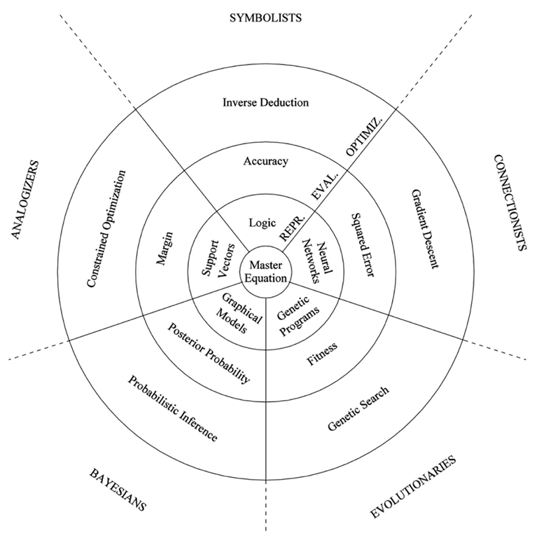

#   Machine Learning Modules (1 month)

##  Outline
| S/N | Domain      | Estimated Duration |
| --- | ----------- | ------------------ |
| 1   | Intro to ML | 1-2 days           |
| 2   | Practical   | 3-4 days           |
| 3   | Advanced ML | 2 weeks            |
| 4   | Assessment  | 1 week             |

##  Intro to ML
This section is meant to provide some background ML knowledge.
If you already understand ML and have enough experience, you can move straight to Advanced ML.

### Overview
*   [A visual introduction to machine learning](http://www.r2d3.us/visual-intro-to-machine-learning-part-1/)
*   [Data Science Primer by EliteDataScience](https://elitedatascience.com/primer)

### Lectures
*   [Machine Learning Algorithms (videos 1 to 6)](https://www.youtube.com/playlist?list=PLEiEAq2VkUULNa6MHQAZSOBxzB6HHFXj4)

### Tutorials
*   [Exploratory data analysis with Pandas](https://nbviewer.jupyter.org/github/Yorko/mlcourse_open/blob/master/jupyter_english/topic01_pandas_data_analysis/topic1_pandas_data_analysis.ipynb?flush_cache=true)
*   [Visual data analysis in Python](https://nbviewer.jupyter.org/github/Yorko/mlcourse_open/blob/master/jupyter_english/topic02_visual_data_analysis/topic2_visual_data_analysis.ipynb?flush_cache=true)

##  Practical
This hands-on section requires practitioners to go through the Kaggle Titanic dataset 
in order to understand, replicate, and tweak the code in the guided explanation. 

### Kaggle Titanic: Machine Learning from Disaster
*   https://www.kaggle.com/c/titanic

### Tips, tools, and guided explanation
*   [How to score 0.8134 in Titanic Kaggle Challenge by Ahmed Besbes](https://ahmedbesbes.com/how-to-score-08134-in-titanic-kaggle-challenge.html)
*   You can find the backup to the guided explanation [here](ahmedbesbes-titanic.pdf)

##  Advanced ML

### Lectures
*   [IBM Machine Learning with Python (weeks 1 to 5)](https://www.coursera.org/learn/machine-learning-with-python)
*   [Stanford Machine Learning (weeks 3, 6, and 8)](https://www.coursera.org/learn/machine-learning)

### Overview
*   [Machine Learning for Everyone](https://vas3k.com/blog/machine_learning/)
*   [Model Tuning and the Bias-Variance Tradeoff](http://www.r2d3.us/visual-intro-to-machine-learning-part-2/)

### Ensemble Methods
*   [Kaggle Ensembling Guide](https://mlwave.com/kaggle-ensembling-guide/)
*   [Bagging, boosting and stacking in machine learning](https://stats.stackexchange.com/questions/18891/bagging-boosting-and-stacking-in-machine-learning)

### Boosting
*   [Introduction to Boosted Trees](https://xgboost.readthedocs.io/en/latest/tutorials/model.html)
*   [Gradient Boosting Interactive Playground](http://arogozhnikov.github.io/2016/07/05/gradient_boosting_playground.html)
*   [Gradient Boosting explained (demonstration)](http://arogozhnikov.github.io/2016/06/24/gradient_boosting_explained.html)

### Practical Application Issues
*   [Machine Learning Explainability](https://www.kaggle.com/learn/machine-learning-explainability)
*   *(Optional)* [A Few Useful Things to Know about Machine Learning (section 2)](cacm12.pdf) (see also the image below)
    *   Symbolists = knowledge-based systems
    *   Connectionists = neural nets
    *   Evolutionaries = genetic algorithms *(not as relevant to data science)*
    *   Bayesians = bayes nets / expert systems
    *   Analogizers = support vector machines
    

### Tutorials
*   [An introduction to machine learning with scikit-learn](https://scikit-learn.org/stable/tutorial/basic/tutorial.html)
*   [Supervised learning: predicting an output variable from high-dimensional observations](https://scikit-learn.org/stable/tutorial/statistical_inference/supervised_learning.html)
*   [Choosing the right estimator *(just for info)*](https://scikit-learn.org/stable/tutorial/machine_learning_map/index.html)

### Available Toolkits
*   Common tools
    *   scikit-learn
    *   XGBoost
    *   Vowpal Wabbit
*   Obscure tools
    *   LightGBM / CatBoost
    *   Regularized Greedy Forest
    *   libFM / fastFM
    *   H2O

### *(Optional)* Optimising thresholds
*   [Machine Learning Meets Economics](http://blog.mldb.ai/blog/posts/2016/01/ml-meets-economics/)
*   [Machine Learning Meets Economics, Part 2](http://blog.mldb.ai/blog/posts/2016/04/ml-meets-economics2/)

### *(Optional)* Deep Learning Appreciation
*   [MIT Deep Learning (videos 1 and 2)](https://www.youtube.com/playlist?list=PLrAXtmErZgOeiKm4sgNOknGvNjby9efdf)
*   someday we’ll add real deep learning with a GPU
    *   probably use MNIST or build word vectors with a small dataset

##  Assessment
You will be attempting the Kaggle Titanic prediction competition
You can either improve on the code in any of the guided explanations, or you can write your own ML code from scratch
Finally, you will present your code / notebooks to the R&D group and explain your choices and reasoning
