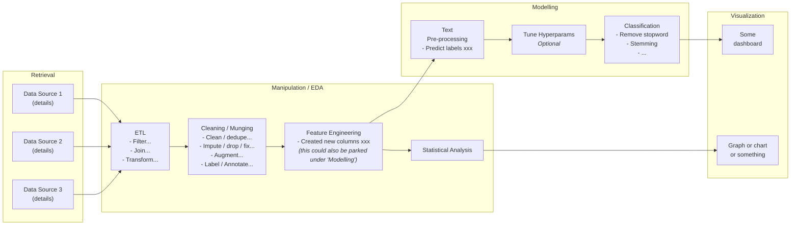

# DSAI Appointment Packet

[//]: # (this was converted from ppt, excuse the strange formatting)

**{first_name} {last_name}**

{department}/{cluster}/{section}

Application for {JR11+}

---
> ***Taken as read***
>
> *Slides with this tag will be read by the tech panel before the presentation day, 
  so you can skip it on the day itself. We'll also read your hidden slides.*

## Self-introduction

* Where you studied, what, and when
* Previous jobs (if any) and what you did there
* When you joined, where you've been posted, and how long

---
> ***Taken as read***
>
> *You can have multiple slides with this tag, but don't overdo it.*

## Experience within the organization

|                                           | IT/ABC/DEF (2019-2021)                                                                                                     | DSAI/ABC/XYZ (2022-Present)                                                                                                                                                          |
|:------------------------------------------|:---------------------------------------------------------------------------------------------------------------------------|:-------------------------------------------------------------------------------------------------------------------------------------------------------------------------------------|
| **R&D**                                   |                                                                                                                            | • Explored some stuff   • Some random project                                                                                                                                     |
| **Engineering**                           | • Designed some ML system                                                                                                  | • Deployed some other inference thing                                                                                                                                                |
| **Tech evaluation / horizon scanning** | • Evaluated some thing or other   • POC on some stuff                                                                   | • Some evaluations don't end up in prod, and that's fine                                                                                                                             |
| **Onboarding, mentorship, & support**  | • Intern - some project   • Intern - some other project                                                                 | • Onboard new data scientist  • Mentor to 2 interns                                                                                                                               |
| **Community Contrib**                     | • Innohack comm                                                                                                            | • Devcom stuff                                                                                                                                                                       |
| **Other**                                 | • Outreach to students   • External / overseas engagement things   • You can delete rows that don't have any content | • If the categories don't fit, feel free to add your own or just create an "Other" to dump everything else   • Can also dump in PM work if you don't want a row dedicated to that |

---

## Project 1

---

### Background/Problem Statement

* Explain problem context
* Help the audience understand the problem from both perspectives:
    * **User perspective:** How does the problem affect the users
    * **Developer perspective:** Frame your problem in technical terms
* What constraints you had
* The goal/objective of the project
* You should demonstrate how you translated the business questions into data questions.

---

### Methodology

* Explain how you turned raw data into insight. Most project methodologies follow this frame:
    * **Data Retrieval** – Help the audience appreciate the data you are working with. Give statistics of volume/variety
      from EDA if possible.
    * **Data Manipulation** – Filtering, Processing. All the stuff you did to the data.
    * **Data Modelling** - Statistical Analysis / Machine Learning
    * **Data Visualization** – How do you interpret output / results?
* It may be useful to have a flowchart to visualize the overall methodology (see next slide), and then elaborate on
  specific portions

---

### Sample Methodology Overview

**DISCLAIMER:** This is just an example of how to provide an overview of your project methodology. Your actual project
may differ in representation.

**1. Retrieval**

* Data Source 1 (details)
* Data Source 2 (details)
* Data Source 3 (details)

**2. Manipulation / EDA**

* **ETL** -> Filter, Join, Transform...
* **Cleaning / Munging** -> Clean / dedupe, Impute / drop / fix, Augment, Label / Annotate...
* **Feature Engineering** -> Created new columns xxx
    * *(This could also be parked under "Modelling")*
* **Statistical Analysis**

**3. Modelling**

* **Text Pre-processing** -> Predict labels xxx
* **Tune Hyperparams** -> (Optional)
* **Classification** -> Remove stopword, Stemming, ...

**4. Visualization**

* Some dashboard
* Graph or chart or something

---

### Methodology – More detail

* Usually you start with getting some data, understanding its provenance, analysis and EDA, and get some kind of
  insights about it
* Talk about something that you explored in depth (which need not have panned out) and go through your analysis step by
  step, explaining your rationale
* What worked and what didn't? What did you find in your lit review (which you probably did)? What are the results of
  your baseline models (if applicable)?
* If you did engineering work, do (very briefly) show your data pipeline and tech stack
* If you just did it in a notebook, that's fine, but do cover the overall workflow and the cleaning steps taken to get
  to the final stage, and how you applied it to real data and presented the results to the end users

---

### Outcome/Results

* Help the audience interpret the results, again from both perspectives:
    * **User perspective:** How can the user interpret the results?
    * **Developer perspective:** Are the results expected? Can you identify causal factors in your results?
* Link back to the problem statement. How does your solution address the problem?
* While outcomes are good, the main goal of data analytics is to have learned something, so it's okay not to have it in
  prod (or to have it in prod but not used by anyone)
    * At least one thing you did should have some kind of outcome though

---

### Outcome/Results (Continued)

* If you have real world results or benchmark scores, you can show these
* Talk about what you learned about the data. Even if what you learned was that it's 90% null and the remainder is
  randomly-generated garbage, at least we now know that
* Retrospective about something that didn't work: at least one feature must have been less useful than expected, or
  maybe there was a user requirement that was a dud. Maybe something suggested by the lit review was not reproducible.
* Share next steps of project if relevant. E.g. you are working on applying your methodology on other datasets/use
  cases, you are experimenting with alternate methods to achieve the same outcome

---

## Project 2

* Presenting a second project is optional (but recommended)
* It helps you can cover all items in the full data project lifecycle
* But if your first project is large enough, that's good too

---

### Note

* Try to avoid presenting your BSEAC project, because that's usually too short to showcase what you can do
* If you can cover a couple of projects in the allotted time it helps to get a feel for the breadth of projects you've
  worked on
* You need to go through a similar process as project 1 (Slide 4-10). However, some of the things (retrospective, things
  you learned) can be done for just one project to save the extra time for questions
* See also the [ml workflow](../README.md#ml-workflow)

---

## END

---

### Other tips – General

* Don't feel limited by this template - you can cover future work, deployment, user testing (maybe skip the endless user
  trials with no conclusions), and whatever else you feel like that's reasonably pertinent
* Your tech stack (if any) need not look like a stack, but you can refer to the SEA slides for inspiration if you want
  it that way
* Do remember you need to show in this presentation that you have demonstrated the competencies in the 
  [**DSAI competency framework**](./dsai-intro.md)

---

### Other tips – Challenges

* Challenges faced in your project would definitely be a topic of discussion. You may prefer to dedicate a slide to
  elaborate on the list of challenges you faced. Alternatively, you may integrate them with each step of your project.
* For challenges which you have overcome, be ready to justify how you did it. Some examples:
    * Shortlisting and deciding on the appropriate algorithm
    * Dealing with issues in data source
    * Visualization-related decisions
* For more open-ended challenges, it may be useful to read up on some theory/concepts (if any) that address them.

---

### Other tips – Visualizations

* Be clear - The key message of your visualization should be apparent.
* Be meticulous in design – The details matter, like:
    * Chart title
    * Axis titles
    * Tick labels
    * Colors
    * Legends
    * Size
    * Aligning x-/y-axes across multiple charts (if applicable)
    * ...