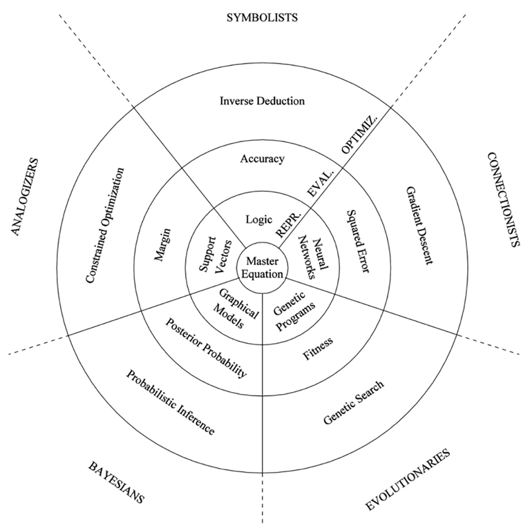

#   Machine Learning (3 weeks)

##  Lectures and Quizzes
### IBM Machine Learning with Python (weeks 1 to 5)
*   https://www.coursera.org/learn/machine-learning-with-python

### Stanford Machine Learning (weeks 3, 6, and 8)
*   https://www.coursera.org/learn/machine-learning

### Deep learning appreciation (optional, videos 1 and 2)
*   https://www.youtube.com/playlist?list=PLrAXtmErZgOeiKm4sgNOknGvNjby9efdf

##  Readings
### Overview
*   https://vas3k.com/blog/machine_learning/
*   http://www.r2d3.us/visual-intro-to-machine-learning-part-2/

### Ensemble methods
*   https://mlwave.com/kaggle-ensembling-guide/
*   https://stats.stackexchange.com/questions/18891/bagging-boosting-and-stacking-in-machine-learning

### Boosting
*   https://xgboost.readthedocs.io/en/latest/tutorials/model.html
*   http://arogozhnikov.github.io/2016/07/05/gradient_boosting_playground.html
*   http://arogozhnikov.github.io/2016/06/24/gradient_boosting_explained.html

### ML explainability
*   https://www.kaggle.com/learn/machine-learning-explainability

### ML = Representation + Evaluation + Optimization (section 2)
*   [link to pdf](https://homes.cs.washington.edu/~pedrod/papers/cacm12.pdf)

**see also this image**

    *   Symbolists = knowledge-based systems
    *   Connectionists = neural nets
    *   Evolutionaries = genetic algorithms (not as relevant to data science)
    *   Bayesians = bayes nets / expert systems
    *   Analogizers = support vector machines

### Optimising thresholds
*   http://blog.mldb.ai/blog/posts/2016/01/ml-meets-economics/
*   http://blog.mldb.ai/blog/posts/2016/04/ml-meets-economics2/

##  Tutorials
### Introduction to ML with scikit-learn
*   https://scikit-learn.org/stable/tutorial/basic/tutorial.html

### Supervised learning with scikit-learn
*   https://scikit-learn.org/stable/tutorial/statistical_inference/supervised_learning.html

### Choosing the right estimator (for information)
*   https://scikit-learn.org/stable/tutorial/machine_learning_map/index.html

##  Available Toolkits (for information)

*   scikit-learn
*   XGBoost
*   Vowpal Wabbit

**More obscure tools**

*   LightGBM / CatBoost
*   Regularized Greedy Forest
*   libFM / fastFM
*   H2O

##  Deep Learning
*   someday we’ll add something using a GPU
*   probably use MNIST or build word vectors with a small dataset

#   Practical (2 weeks)
*   Officer to improve on the Kaggle Titanic codes given in the guided explanation
